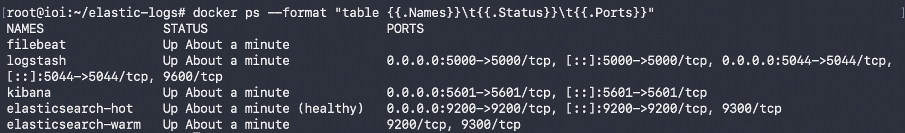
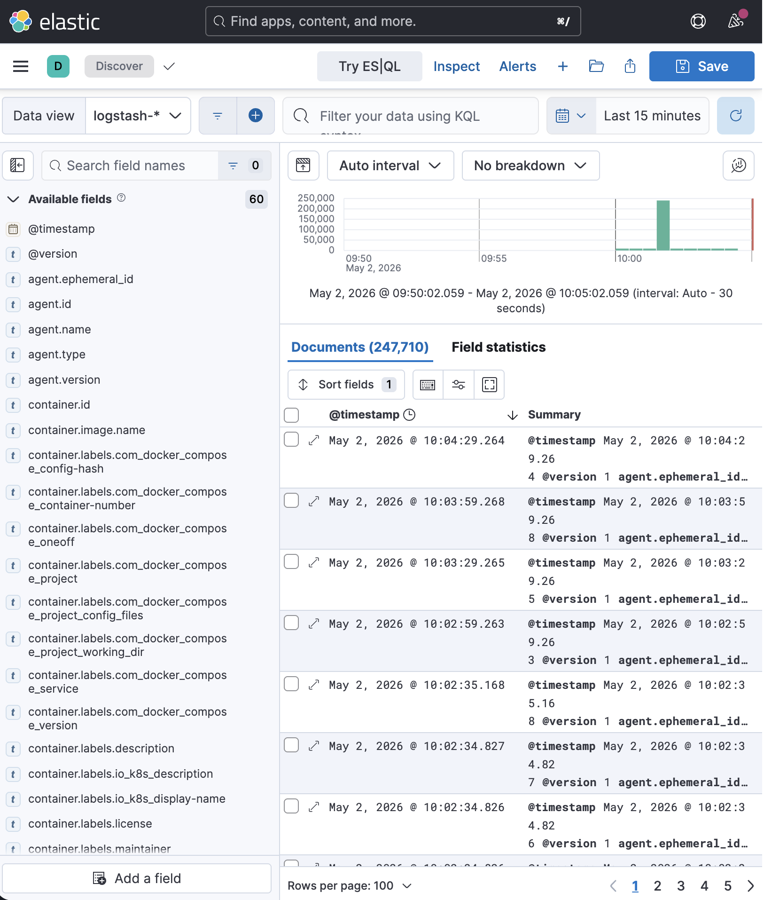

# Домашнее задание «Система сбора логов Elastic Stack»

## Цель работы

В рамках домашнего задания был развёрнут стек сбора и анализа логов Elastic Stack в Docker.

Были подняты и связаны между собой следующие компоненты:

- Elasticsearch hot node;
- Elasticsearch warm node;
- Logstash;
- Kibana;
- Filebeat.

Logstash был настроен на приём JSON-сообщений по TCP.  
Filebeat был настроен на отправку Docker-логов системы в Logstash.

Директория `help` при выполнении задания не использовалась.

---

## Подготовка виртуальной машины

Для выполнения задания использовалась виртуальная машина в Yandex Cloud.

На сервере были установлены Docker и Docker Compose:

```bash
apt update
apt install -y docker.io docker-compose curl
```

Также был увеличен параметр `vm.max_map_count`, который необходим для корректной работы Elasticsearch:

```bash
sudo sysctl -w vm.max_map_count=1048576
echo "vm.max_map_count=1048576" | sudo tee -a /etc/sysctl.conf
```

Проверка значения:

```bash
sysctl vm.max_map_count
```

Результат:

```text
vm.max_map_count = 1048576
```

---

## Структура проекта

Была создана рабочая директория:

```bash
mkdir -p ~/elastic-logs/{logstash,pipeline,filebeat}
cd ~/elastic-logs
```

Итоговая структура проекта:

```text
elastic-logs/
├── docker-compose.yml
├── filebeat/
│   └── filebeat.yml
├── logstash/
└── pipeline/
    └── logstash.conf
```

---

## docker-compose.yml

```yaml
services:
  elasticsearch-hot:
    image: docker.elastic.co/elasticsearch/elasticsearch:8.17.0
    container_name: elasticsearch-hot
    environment:
      - node.name=elasticsearch-hot
      - cluster.name=elastic-docker-cluster
      - discovery.seed_hosts=elasticsearch-warm
      - cluster.initial_master_nodes=elasticsearch-hot
      - node.roles=master,data_hot,data_content,ingest
      - bootstrap.memory_lock=true
      - xpack.security.enabled=false
      - ES_JAVA_OPTS=-Xms1g -Xmx1g
    ulimits:
      memlock:
        soft: -1
        hard: -1
    volumes:
      - es-hot-data:/usr/share/elasticsearch/data
    ports:
      - "9200:9200"
    networks:
      - elastic
    healthcheck:
      test: ["CMD-SHELL", "curl -s http://localhost:9200/_cluster/health || exit 1"]
      interval: 20s
      timeout: 10s
      retries: 10

  elasticsearch-warm:
    image: docker.elastic.co/elasticsearch/elasticsearch:8.17.0
    container_name: elasticsearch-warm
    environment:
      - node.name=elasticsearch-warm
      - cluster.name=elastic-docker-cluster
      - discovery.seed_hosts=elasticsearch-hot
      - cluster.initial_master_nodes=elasticsearch-hot
      - node.roles=data_warm
      - bootstrap.memory_lock=true
      - xpack.security.enabled=false
      - ES_JAVA_OPTS=-Xms1g -Xmx1g
    ulimits:
      memlock:
        soft: -1
        hard: -1
    volumes:
      - es-warm-data:/usr/share/elasticsearch/data
    networks:
      - elastic

  logstash:
    image: docker.elastic.co/logstash/logstash:8.17.0
    container_name: logstash
    depends_on:
      - elasticsearch-hot
      - elasticsearch-warm
    ports:
      - "5044:5044"
      - "5000:5000"
    volumes:
      - ./pipeline/logstash.conf:/usr/share/logstash/pipeline/logstash.conf:ro
    networks:
      - elastic

  kibana:
    image: docker.elastic.co/kibana/kibana:8.17.0
    container_name: kibana
    depends_on:
      - elasticsearch-hot
    environment:
      - ELASTICSEARCH_HOSTS=http://elasticsearch-hot:9200
      - SERVER_HOST=0.0.0.0
    ports:
      - "5601:5601"
    networks:
      - elastic

  filebeat:
    image: docker.elastic.co/beats/filebeat:8.17.0
    container_name: filebeat
    user: root
    depends_on:
      - logstash
    command: ["filebeat", "-e", "--strict.perms=false"]
    volumes:
      - ./filebeat/filebeat.yml:/usr/share/filebeat/filebeat.yml:ro
      - /var/lib/docker/containers:/var/lib/docker/containers:ro
      - /var/run/docker.sock:/var/run/docker.sock:ro
    networks:
      - elastic

volumes:
  es-hot-data:
  es-warm-data:

networks:
  elastic:
    driver: bridge
```

---

## Конфигурация Logstash

Файл конфигурации:

```text
pipeline/logstash.conf
```

Содержимое файла:

```conf
input {
  beats {
    port => 5044
  }

  tcp {
    port => 5000
    codec => json
  }
}

filter {
  if [container][name] {
    mutate {
      add_field => {
        "docker_container" => "%{[container][name]}"
      }
    }
  }
}

output {
  elasticsearch {
    hosts => ["http://elasticsearch-hot:9200"]
    index => "logstash-%{+YYYY.MM.dd}"
  }

  stdout {
    codec => rubydebug
  }
}
```

Logstash принимает данные двумя способами:

- от Filebeat через Beats input на порту `5044`;
- JSON-сообщения по TCP на порту `5000`.

После обработки события отправляются в Elasticsearch в индекс вида:

```text
logstash-YYYY.MM.dd
```

Также был добавлен вывод в `stdout`, чтобы можно было анализировать поступающие события через логи контейнера Logstash.

---

## Конфигурация Filebeat

Файл конфигурации:

```text
filebeat/filebeat.yml
```

Содержимое файла:

```yaml
filebeat.inputs:
  - type: container
    enabled: true
    paths:
      - /var/lib/docker/containers/*/*.log
    processors:
      - add_docker_metadata:
          host: "unix:///var/run/docker.sock"

output.logstash:
  hosts: ["logstash:5044"]

logging.level: info
logging.to_files: false
logging.to_stderr: true
```

Filebeat читает Docker-логи из директории:

```text
/var/lib/docker/containers/*/*.log
```

После этого Filebeat отправляет события в Logstash на порт `5044`.

---

## Запуск стека

Запуск контейнеров выполнялся командой:

```bash
cd ~/elastic-logs
docker-compose up -d
```

Проверка запущенных контейнеров:

```bash
docker ps --format "table {{.Names}}\t{{.Status}}\t{{.Ports}}"
```

Результат:

```text
NAMES                STATUS                   PORTS
filebeat             Up 9 minutes
logstash             Up 9 minutes             0.0.0.0:5000->5000/tcp, [::]:5000->5000/tcp, 0.0.0.0:5044->5044/tcp, [::]:5044->5044/tcp, 9600/tcp
kibana               Up 9 minutes             0.0.0.0:5601->5601/tcp, [::]:5601->5601/tcp
elasticsearch-hot    Up 9 minutes (healthy)   0.0.0.0:9200->9200/tcp, [::]:9200->9200/tcp, 9300/tcp
elasticsearch-warm   Up 9 minutes             9200/tcp, 9300/tcp
```

Все 5 контейнеров успешно запущены:

- `filebeat`;
- `logstash`;
- `kibana`;
- `elasticsearch-hot`;
- `elasticsearch-warm`.

Скриншот `docker ps` через несколько минут после запуска:



---

## Проверка Elasticsearch

Проверка списка индексов:

```bash
curl "http://localhost:9200/_cat/indices?v"
```

Результат:

```text
health status index                                                              uuid                   pri rep docs.count docs.deleted store.size pri.store.size dataset.size
green  open   .internal.alerts-transform.health.alerts-default-000001            5tGmBLtATd6GV2WfQneoxg   1   0          0            0       249b           249b         249b
green  open   .internal.alerts-observability.logs.alerts-default-000001          efIO1EGkRdWxUhOKyzEvPg   1   0          0            0       249b           249b         249b
green  open   .internal.alerts-observability.uptime.alerts-default-000001        yuoQ0_D4S7qoMwm1Wj3Yrw   1   0          0            0       249b           249b         249b
green  open   .internal.alerts-ml.anomaly-detection.alerts-default-000001        Lny3_ECiQQusJVqjbW86jg   1   0          0            0       249b           249b         249b
green  open   .internal.alerts-observability.slo.alerts-default-000001           G5J5PSE2RRiqq89_J4qxoA   1   0          0            0       249b           249b         249b
green  open   .internal.alerts-default.alerts-default-000001                     n1SwsyMiSkeoUVaaQsOiIQ   1   0          0            0       249b           249b         249b
green  open   .internal.alerts-observability.apm.alerts-default-000001           09WI9gocQUKGjareo5rrvA   1   0          0            0       249b           249b         249b
green  open   .internal.alerts-observability.metrics.alerts-default-000001       1zhlO-nIQVap-neL9LMVbw   1   0          0            0       249b           249b         249b
green  open   .internal.alerts-ml.anomaly-detection-health.alerts-default-000001 1l4Qx01eSeCChdcBWd1HUw   1   0          0            0       249b           249b         249b
green  open   .internal.alerts-observability.threshold.alerts-default-000001     I-yWzZC1RDGdDey-Ix1L_g   1   0          0            0       249b           249b         249b
green  open   .internal.alerts-security.alerts-default-000001                    kgLLMpB2QUK47NATuWPtTA   1   0          0            0       249b           249b         249b
green  open   .internal.alerts-stack.alerts-default-000001                       I1301BlGS2G5kncMQdEa9A   1   0          0            0       249b           249b         249b
yellow open   logstash-2026.05.02                                                mpW82uqfSGO5BFIhe-Xu8Q   1   1     517210            0      137mb          137mb        137mb
```

В результате проверки видно, что индекс `logstash-2026.05.02` успешно создан.

Индекс имеет статус `yellow`, потому что для него указана одна реплика, но в текущей конфигурации она не распределена полностью. Для выполнения задания это не является критичной ошибкой, так как индекс создан и данные в него поступают.

Количество документов в индексе:

```text
517210
```

Это подтверждает, что логи Docker-контейнеров успешно собираются Filebeat, передаются в Logstash и записываются в Elasticsearch.

---

## Kibana

Kibana доступна по адресу:

```text
http://111.88.241.96:5601
```

В Kibana был создан Data View:

```text
logstash-*
```

Поле времени:

```text
@timestamp
```

После создания Data View был открыт раздел:

```text
Analytics → Discover
```

В Discover отображаются события из индекса `logstash-*`.

Скриншот интерфейса Kibana Discover:



---

## Проверка отображения логов в Discover

В Kibana Discover отображаются документы из индекса `logstash-*`.

На скриншоте видно:

- выбран Data View `logstash-*`;
- доступны поля события;
- используется временной фильтр `Last 15 minutes`;
- отображаются документы;
- количество документов в Discover — более 247 тысяч.

Это подтверждает, что цепочка сбора логов работает:

```text
Docker logs → Filebeat → Logstash → Elasticsearch → Kibana
```

---

## Проверка TCP JSON input в Logstash

Logstash также был настроен на приём JSON-сообщений по TCP на порту `5000`.

Для проверки можно использовать команду:

```bash
echo '{"message":"test json message from tcp","level":"INFO","app":"manual-test"}' | nc localhost 5000
```

После отправки такого события оно должно попасть в индекс `logstash-*` и отображаться в Kibana Discover.

Пример поиска в Kibana:

```text
message : "test json message from tcp"
```

Или:

```text
app : "manual-test"
```

---

## Возможные проблемы и их решение

### Ошибка `vm.max_map_count`

Если Elasticsearch не запускается и в логах есть ошибка про `vm.max_map_count`, нужно выполнить:

```bash
sudo sysctl -w vm.max_map_count=1048576
echo "vm.max_map_count=1048576" | sudo tee -a /etc/sysctl.conf
```

После этого перезапустить стек:

```bash
docker-compose down
docker-compose up -d
```

---

### Не открывается Kibana

Если Kibana не открывается по адресу:

```text
http://<public_ip>:5601
```

нужно проверить, что контейнер запущен:

```bash
docker ps
```

Также нужно проверить, что порт `5601` открыт во входящих правилах Security Group в Yandex Cloud.

---

### Не появляется индекс `logstash-*`

Если индекс `logstash-*` не появляется, нужно проверить логи Filebeat и Logstash:

```bash
docker logs filebeat
docker logs logstash
```

Также можно проверить индексы напрямую через Elasticsearch:

```bash
curl "http://localhost:9200/_cat/indices?v"
```

---

## Вывод

В результате выполнения домашнего задания был развёрнут Elastic Stack в Docker без использования директории `help`.

Были подняты 5 контейнеров:

- Elasticsearch hot node;
- Elasticsearch warm node;
- Logstash;
- Kibana;
- Filebeat.

Filebeat собирает Docker-логи с хостовой системы и отправляет их в Logstash.

Logstash принимает события от Filebeat, а также JSON-сообщения по TCP, после чего отправляет данные в Elasticsearch.

Elasticsearch создаёт индекс `logstash-*`, в котором хранятся собранные логи.

В Kibana был создан Data View `logstash-*`, после чего логи были успешно просмотрены через Discover.

Задание выполнено.
